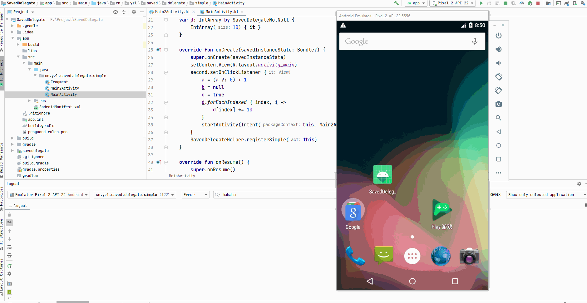

## SavedDelegate

## 项目描述

[](https://jitpack.io/#yizems/SavedDelegate)

还在傻傻的写 `onSaveInstanceState` 和 `onRestoreInstanceState` 方法么?

还在为项目中 大量的 未保存和恢复处理的变量 引起的错误 头疼?

**Just do it!!! you can fly!!!**

## 使用方法

```kotlin

//使用 delegate
var a: Int? by SavedDelegates.nullable { 10 }

var b: IntArray by SavedDelegates.notNull {
    IntArray(10) { it }
}

//在Activity 合适的方法中(onCreate?,onResume?, 总之在 页面关闭之前调用即可)
SavedDelegateHelper.registerSimple(activity)
//或
SavedDelegateHelper.registerSimple(fragment)

//或
SavedDelegateHelper.registerSavedProvider(savedStateRegistry,activity/fragment)
//或
SavedDelegateHelper.registerWithLifecycle(lifecycleOwner,savedStateRegistry,activity/fragment)
```

然后,你的这些变量,在页面被销毁时,就会被自动恢复了!!

## 效果

打开手机 开发者模式中的 不保留活动




## 项目依赖

- androidx 和kotlin ,所以一定要是 kotlin 开发的项目,并且迁移了androidx库
- 真正保存和恢复数据的是savestate库,这个库在 androidx 中默认被导入,所以可以直接使用

## TODO

- 没有测试效率问题,因为保存数据采用了反射
- 保存数据时会检查数据是否能够写入Bundle,主要是类型判断,这样存在隐患,需要触发了才能报错,想办法提前,检验
- 还没有进行比较全面的测试,主要是数据类型方面


## 更新日志

###  0.0.1

项目初步完成,还没有进行比较全面的测试(数据类型方面)

## 实现思路

1. 熟悉 savestate 库,强烈建议大家去看看
2. 使用属性委托在get方法中,查询 savedStateRegistry 中保存的数据
3. 为savedStateRegistry 注册 SavedStateRegistry.SavedStateProvider
4. 在 SavedStateRegistry.SavedStateProvider 中,使用反射,读取 activity/fragment 中使用了委托对象的属性
5. 获取到对象属性后,获取值和类型,调用Bundle 相应的方法写入即可
